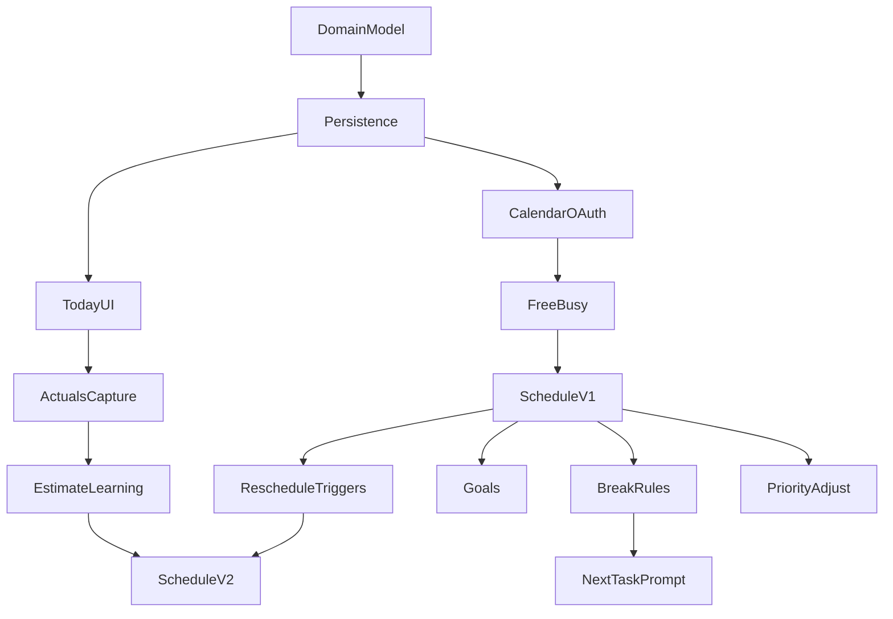

# AI-Powered Daily Planner — Concise Roadmap (2026-02-09)

Concise, execution-ready roadmap derived from `aiDocs/prd.md` and the detailed roadmap at `ai/roadmaps/2026-02-09-ai-daily-planner-roadmap.md`.

## Definitions (short)

- **Task**: user-entered unit of work with \(duration\), \(deadline\), and \(priority\).
- **CalendarEvent**: external busy block from an integrated calendar.
- **PlannedBlock**: scheduled unit (task, break, or goal block) with start/end times.
- **LockedBlock**: planned block that cannot move during re-scheduling.

---

## Phase 1 — Foundation (data model, persistence, basic UX)

- [ ] **Define domain model (Task, CalendarEvent, PlannedBlock, LockedBlock)**
  - **Completion criteria**
    - Data fields + invariants are documented (including: all-day events, time zones, DST edge cases).
    - Planned blocks can reference a source task/goal and store a placement reason.
  - **Depends on**: none

- [ ] **Persist tasks and planned blocks**
  - **Completion criteria**
    - CRUD for tasks and planned blocks exists.
    - External calendar events are stored/represented separately from app-generated planned blocks.
  - **Depends on**: Define domain model

- [ ] **Basic “Today” view + task editor**
  - **Completion criteria**
    - User can create/edit tasks (duration, priority, deadline).
    - Day timeline renders planned blocks from storage.
  - **Depends on**: Persist tasks and planned blocks

---

## Phase 2 — Calendar integration + schedule construction (P0)

- [ ] **Calendar OAuth connect (provider 1, read-only)**
  - **Completion criteria**
    - User can connect and disconnect calendar integration.
    - Tokens are stored securely.
    - UI shows sync status (fresh/stale/error) and supports manual refresh.
  - **Depends on**: Persist tasks and planned blocks

- [ ] **Fetch calendar events + compute free/busy**
  - **Completion criteria**
    - For a date range/day, calendar events are loaded reliably.
    - Free windows are computed correctly (no overlap with busy events).
    - Time zones + all-day events are handled correctly.
  - **Depends on**: Calendar OAuth connect

- [ ] **Scheduling engine v1: build daily plan**
  - **Completion criteria**
    - Given tasks + constraints + free windows, outputs non-overlapping planned blocks.
    - Produces an explicit “overflow” list when tasks cannot fit.
    - Stores placement metadata (“why this block is here”).
  - **Depends on**: Fetch calendar events + compute free/busy; Persist tasks and planned blocks

---

## Phase 3 — Dynamic re-scheduling + feedback loops (P0)

- [ ] **Change detection triggers**
  - **Completion criteria**
    - Detects calendar changes (event moved/added/extended) and user “running late / start now”.
    - Debounces rapid updates (prevents thrash).
  - **Depends on**: Fetch calendar events + compute free/busy

- [ ] **Scheduling engine v2: re-schedule remaining work**
  - **Completion criteria**
    - Preserves completed blocks.
    - Respects LockedBlocks.
    - Minimizes churn (only moves what must move to resolve conflicts).
    - Resolves new conflicts and updates the plan quickly.
  - **Depends on**: Scheduling engine v1; Change detection triggers

- [ ] **Capture actual vs planned durations**
  - **Completion criteria**
    - User can record actual completion (timestamped) or “took X minutes”.
    - Actuals are persisted per task/block and are accessible to the engine.
  - **Depends on**: Basic “Today” view + task editor

- [ ] **Estimate learning + overload prevention**
  - **Completion criteria**
    - Rolling estimates update based on actuals (per user and optionally per tag/category).
    - Engine uses buffers or conservative estimates for chronic overruns.
  - **Depends on**: Capture actual vs planned durations; Scheduling engine v2

---

## Phase 4 — Personalization + decision-fatigue reduction (P1/P2)

- [ ] **Goals model + goal incorporation (P1)**
  - **Completion criteria**
    - User can define goals (professional/academic/social) and link tasks to goals.
    - Scheduling includes goal-relevant items/blocks with clear rationale.
  - **Depends on**: Persist tasks and planned blocks; Scheduling engine v1

- [ ] **Break rules + flexibility buffers (P1)**
  - **Completion criteria**
    - Configurable break policy exists (e.g., short breaks after focus blocks, lunch window).
    - Schedule inserts breaks and preserves whitespace/buffers; avoids overloading the day.
  - **Depends on**: Scheduling engine v1 (recommended: after Scheduling engine v2)

- [ ] **Next-task prompt (P1)**
  - **Completion criteria**
    - “What should I do now?” uses current time + plan to recommend the next task/block.
    - “Skip” flow yields the next best recommendation without manual re-planning.
  - **Depends on**: Scheduling engine v1; Break rules + flexibility buffers

- [ ] **Priority adjustment (P2)**
  - **Completion criteria**
    - User can adjust priorities; schedule updates predictably on next run.
    - Deadline proximity influences ordering in a deterministic, explainable way.
  - **Depends on**: Scheduling engine v1 (recommended: after Scheduling engine v2)

---

## Dependencies overview (critical path)

