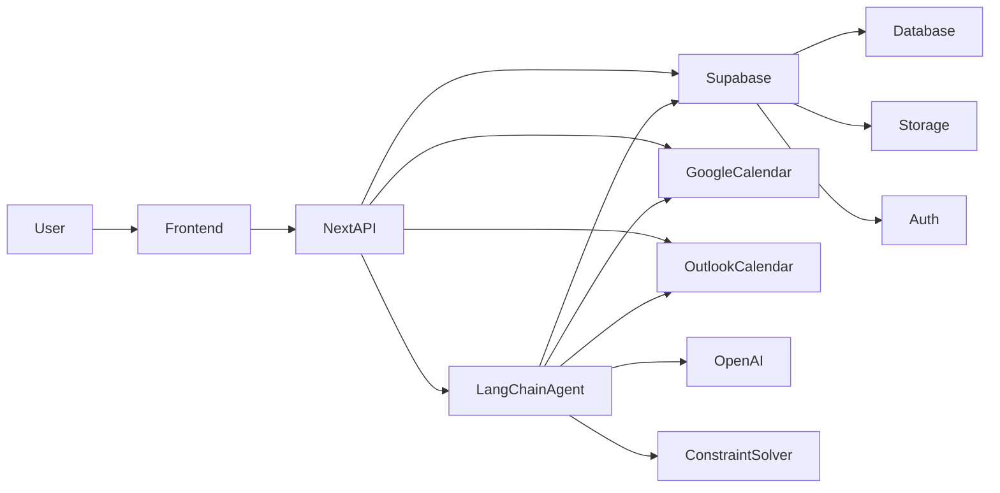

# System Architecture

## Overview

Stride is an AI-powered daily planner for knowledge workers with unstructured schedules — freelancers, developers, remote professionals, students, and individuals with ADHD. Users add tasks (text, photos, voice) and connect their calendar (Google or Outlook); "Plan my day" triggers an agentic AI system that reasons through tasks, priorities, and constraints to build a daily schedule. A chat modal lets users interact with the agent throughout the day to report progress, add tasks, and trigger rescheduling. The app is delivered as a PWA (installable, own window/icon) and uses browser notifications for task reminders. **Backend and data are built on Supabase.** MVP is today-only, no calendar cache. See `aiDocs/mvp.md` for scope and timeline.

## High-Level Architecture

- **Frontend**: Next.js app (React, TypeScript, Tailwind); task list, timeline view, "Plan my day" action, agent chat modal; delivered as a PWA (installable to desktop/home screen).
- **Backend: Supabase**
  - **Auth**: Supabase Auth for user identity.
  - **Database**: Supabase (PostgreSQL). Tables: `profiles` (user metadata), `calendar_tokens` (OAuth tokens per user per provider — Google, Outlook), `tasks`, `scheduled_blocks`, `agent_conversations` (chat history per user per day); no stored calendar events (fetch on demand).
  - **Storage**: Supabase Storage for task attachments (e.g. photos); tasks reference file paths or public URLs.
  - **API**: Next.js API routes call Supabase (client or service role as needed) for tasks, schedule, and calendar OAuth callbacks; "Plan my day" triggers the agentic scheduling system and persists blocks to Supabase.
- **Calendar Providers**: Google Calendar and Outlook Calendar. OAuth 2.0, read-only; fetch today's events when user hits "Plan my day." **Attached per user** (tokens stored in Supabase after user connects). Events from all connected calendars merged into a single busy-windows list.
  - **Google Calendar**: Google OAuth 2.0, Google Calendar API v3.
  - **Outlook Calendar**: Microsoft OAuth 2.0 (MSAL), Microsoft Graph API.
- **AI: Agentic System (LangChain + OpenAI)**
  - **LangChain Agent**: Orchestrates multi-step scheduling. Tools: `getTaskList`, `getCalendarEvents`, `createScheduledBlock`, `checkForConflicts`, `updateTask`, `askUserForClarification`. Max iteration guardrail to prevent runaway loops.
  - **Hybrid Architecture**: LLM (OpenAI GPT-4o-mini) handles reasoning, intent, and priority decisions (natural language → structured JSON). Deterministic constraint solver handles actual time placement and conflict detection — no LLM time-math.
  - **Stability Buffer**: Rescheduling prefers minimal adjustments (cut/defer low-priority tasks) over cascading ripple effects. Optimizes for psychological comfort, not perfect time utilization.
  - **Chat Interface**: Agent maintains conversation context per user per day (`agent_conversations` table) for mid-day interactions (progress updates, new tasks, rescheduling requests).
  - **Streaming**: Both schedule building and chat use Server-Sent Events (SSE) to stream agent progress to the frontend in real-time. Event types: `thinking`, `tool_call`, `text`, `schedule_update`, `done`, `error`.
  - All API keys server-side only (env vars). Agent actions logged for debugging.

## Data Flow: Plan my day

1. User clicks "Plan my day."
2. Next.js API initializes LangChain agent with user context.
3. Agent calls `getCalendarEvents` tool — fetches today's events from all connected calendars (Google and/or Outlook), merges into busy-windows list.
4. Agent calls `getTaskList` tool — loads tasks from Supabase (and any attachment URLs from Storage).
5. Agent reasons about priorities, constraints, and ordering (LLM step).
6. Deterministic constraint solver places tasks into free slots, enforces no overlaps, respects working hours and break rules.
7. If tasks exceed available time, agent surfaces the conflict — suggests what to defer or drop.
8. Agent calls `createScheduledBlock` tool — saves blocks to Supabase; returns timeline + overflow to frontend.

## Data Flow: Mid-day chat update

1. User opens chat modal, types a message (e.g. "I finished the report early" or "add groceries, 30 min").
2. Next.js API passes message to LangChain agent with existing conversation context and current schedule state.
3. Agent interprets intent, calls relevant tools (update task status, add new task, fetch updated calendar).
4. Agent applies stability-first rescheduling — prefers minimal adjustments over cascade reshuffles.
5. Updated schedule saved to Supabase; timeline refreshes on frontend.
6. Agent responds conversationally explaining what changed and why.

## Database Schema

| Table | Key Columns | Purpose |
|-------|------------|---------|
| `profiles` | id, email, subscription_tier, created_at | User metadata (auto-created on signup via trigger) |
| `calendar_tokens` | id, user_id, provider ('google' \| 'outlook'), access_token, refresh_token, token_expires_at | OAuth tokens per user per calendar provider. Unique on (user_id, provider) |
| `tasks` | id, user_id, title, notes, duration_minutes, photo_url, goal_id (future) | User's task list |
| `scheduled_blocks` | id, user_id, task_id, start_time, end_time, title, source | Generated schedule blocks for today |
| `agent_conversations` | id, user_id, date, messages (jsonb) | Chat history per user per day. Unique on (user_id, date) |

All tables have RLS policies scoping to the authenticated user's own data. Auto-creates profile on signup via `handle_new_user` trigger.

## PWA and Notifications

- **PWA**: Web app manifest + minimal service worker so the app is installable; standalone window and icon. No offline-first requirement for MVP.
- **Notifications**: Client-side only for MVP. When the user has a schedule, the frontend can schedule or show notifications at block start (e.g. `new Notification("Time to: Review Q3 report", { body: "Scheduled for 30 minutes", icon: "/icon.png" })`). Permission requested in-app via `Notification.requestPermission()`. No backend push service; reminders are derived from the current day's scheduled_blocks in the client.

## Key Decisions

- **Supabase** for auth, database (PostgreSQL), and file storage (task photos). Next.js talks to Supabase via client SDK or server-side with service role where needed. Users sign in with Supabase Auth; **calendar providers are attached per user** (OAuth tokens stored per user per provider in Supabase).
- **LangChain + OpenAI** for agentic AI scheduling. The LangChain agent orchestrates multi-step tool use (fetch tasks, fetch calendar, reason about placement, write blocks). OpenAI GPT-4o-mini provides the LLM reasoning. A deterministic constraint solver handles time-math (no LLM hallucinations on temporal logic). API keys in env only; all calls from Next.js API routes.
- **Hybrid architecture**: LLM for reasoning/intent, deterministic solver for time placement. This prevents the known issue of LLMs hallucinating overlapping time blocks.
- **Stability-first rescheduling**: When the agent reschedules, it prefers cutting/deferring low-priority tasks over ripple-reshuffling the entire day. This is a deliberate design choice for users with ADHD and anyone who experiences anxiety from constant plan changes.
- **Multi-calendar**: Google Calendar and Outlook Calendar. Events merged into a single busy-windows list. Architecture supports additional providers in the future.
- **`calendar_tokens` table**: Multi-provider token storage instead of Google-specific columns on `profiles`. Supports Google and Outlook now; extensible to Apple Calendar later.
- **SSE streaming**: Agent responses streamed to frontend via Server-Sent Events for real-time progress feedback during both schedule building and chat.
- Calendar fetched on demand (no cache).
- Today only for MVP.
- PWA for native-app feel (installable). Browser notifications for task reminders; client-only in MVP, no push server.

## Environment Variables

Required in `.env.local`:
- `NEXT_PUBLIC_SUPABASE_URL`, `NEXT_PUBLIC_SUPABASE_ANON_KEY`, `SUPABASE_SERVICE_ROLE_KEY`
- `OPENAI_API_KEY`
- `GOOGLE_CLIENT_ID`, `GOOGLE_CLIENT_SECRET`, `GOOGLE_REDIRECT_URI`
- `MICROSOFT_CLIENT_ID`, `MICROSOFT_CLIENT_SECRET`, `MICROSOFT_REDIRECT_URI`

## Dependencies (Key Additions for Agent)

- `langchain`, `@langchain/openai`, `@langchain/core` — LangChain agent framework
- `@azure/msal-node` — Microsoft OAuth for Outlook Calendar