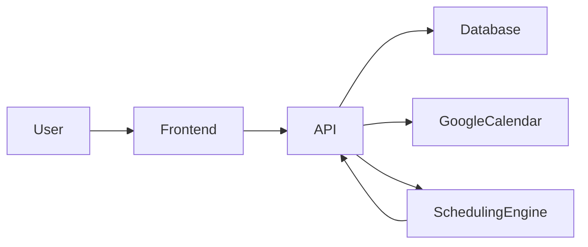

# System Architecture

## Overview

Stride is an AI-powered daily planner. Users add tasks and connect Google Calendar; "Plan my day" runs a scheduling engine that places tasks into today's free slots and shows a timeline. The app is delivered as a PWA (installable, own window/icon) and uses browser notifications for task reminders. MVP is today-only, no calendar cache, manual refresh. See `aiDocs/mvp.md` for scope and timeline.

## High-Level Architecture

- **Frontend**: Next.js app (React, TypeScript, Tailwind); task list, timeline view, "Plan my day" action; delivered as a PWA (installable to desktop/home screen).
- **API**: Next.js API routes (or standalone Node server); endpoints for tasks, schedule, calendar OAuth callback, and "Plan my day" (trigger engine + persist blocks).
- **Database**: Persist users (for OAuth identity), tasks, scheduled_blocks; no stored calendar events (fetch on demand).
- **Google Calendar**: OAuth 2.0, read-only; fetch today's events when user hits "Plan my day."
- **Scheduling engine**: Pure function or service: inputs = tasks (title, duration, "Do today" flag), today's busy windows, working hours; output = scheduled_blocks + overflow list; greedy placement, "Do today" then list order.

## Data Flow: Plan my day

1. User clicks "Plan my day."
2. API fetches today's events from Google Calendar.
3. Load tasks from DB.
4. Run scheduling engine (free windows + working hours).
5. Save scheduled_blocks; return timeline + overflow to frontend.

## PWA and Notifications

- **PWA**: Web app manifest + minimal service worker so the app is installable; standalone window and icon. No offline-first requirement for MVP.
- **Notifications**: Client-side only for MVP. When the user has a schedule, the frontend can schedule or show notifications at block start (e.g. `new Notification("Time to: Review Q3 report", { body: "Scheduled for 30 minutes", icon: "/icon.png" })`). Permission requested in-app via `Notification.requestPermission()`. No backend push service; reminders are derived from the current day's scheduled_blocks in the client.

## Key Decisions

- Calendar fetched on demand (no cache).
- Today only for MVP.
- Single calendar provider (Google).
- Auth is calendar OAuth only (no full auth system for MVP).
- PWA for native-app feel (installable, ~1 day). Browser notifications for task reminders; client-only in MVP, no push server.
