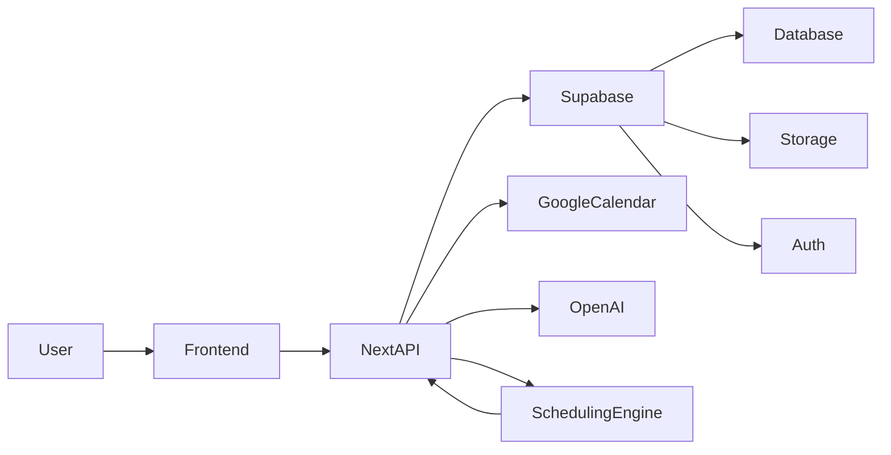

# System Architecture

## Overview

Stride is an AI-powered daily planner. Users add tasks and connect Google Calendar; "Plan my day" runs a scheduling engine that places tasks into today's free slots and shows a timeline. The app is delivered as a PWA (installable, own window/icon) and uses browser notifications for task reminders. **Backend and data are built on Supabase.** MVP is today-only, no calendar cache, manual refresh. See `aiDocs/mvp.md` for scope and timeline.

## High-Level Architecture

- **Frontend**: Next.js app (React, TypeScript, Tailwind); task list, timeline view, "Plan my day" action; delivered as a PWA (installable to desktop/home screen).
- **Backend: Supabase**
  - **Auth**: Supabase Auth for user identity; link or store Google Calendar OAuth tokens per user (e.g. in user metadata or a `profiles`/`calendar_tokens` table).
  - **Database**: Supabase (PostgreSQL). Tables: `users`/profiles, `tasks`, `scheduled_blocks`; no stored calendar events (fetch on demand).
  - **Storage**: Supabase Storage for task attachments (e.g. photos); tasks reference file paths or public URLs.
  - **API**: Next.js API routes call Supabase (client or service role as needed) for tasks, schedule, and calendar OAuth callback; "Plan my day" triggers the scheduling engine and persists blocks to Supabase.
- **Google Calendar**: OAuth 2.0, read-only; fetch today's events when user hits "Plan my day." **Attached per user** (tokens stored in Supabase after user connects).
- **AI: OpenAI API** — Used for schedule construction and smart placement (e.g. priorities, context from task text/photos). Next.js API routes call OpenAI; keep API key server-side only (env var).
- **Scheduling engine**: Uses OpenAI API where helpful; inputs = tasks (title, duration, optional photo refs), today's busy windows, working hours; output = scheduled_blocks + overflow list. Can combine rule-based placement with AI for ordering or time suggestions.

## Data Flow: Plan my day

1. User clicks "Plan my day."
2. Next.js API (using Supabase) fetches today's events from Google Calendar.
3. Load tasks from Supabase (and any attachment URLs from Storage).
4. Run scheduling engine (optionally using OpenAI API for placement); inputs = free windows + working hours + tasks.
5. Save scheduled_blocks to Supabase; return timeline + overflow to frontend.

## PWA and Notifications

- **PWA**: Web app manifest + minimal service worker so the app is installable; standalone window and icon. No offline-first requirement for MVP.
- **Notifications**: Client-side only for MVP. When the user has a schedule, the frontend can schedule or show notifications at block start (e.g. `new Notification("Time to: Review Q3 report", { body: "Scheduled for 30 minutes", icon: "/icon.png" })`). Permission requested in-app via `Notification.requestPermission()`. No backend push service; reminders are derived from the current day's scheduled_blocks in the client.

## Key Decisions

- **Supabase** for auth, database (PostgreSQL), and file storage (task photos). Next.js talks to Supabase via client SDK or server-side with service role where needed. Users sign in with Supabase Auth; **Google Calendar is attached to that user** (OAuth tokens stored per user in Supabase).
- **OpenAI API** for AI-powered scheduling (schedule construction, placement, priorities). API key in env only; all calls from Next.js API routes.
- Calendar fetched on demand (no cache).
- Today only for MVP.
- Single calendar provider (Google).
- PWA for native-app feel (installable, ~1 day). Browser notifications for task reminders; client-only in MVP, no push server.